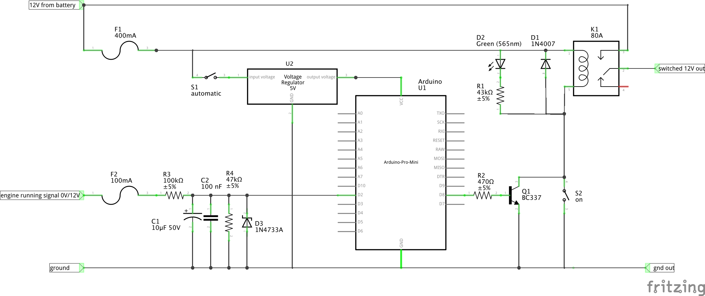

# In-car Arduino smart relay
#### Snippet for Arduino use in automobile environments
This project demonstrates how to control a high-current automotive relay with an Arduino, triggered by a low-current 12 V signal line, including a configurable delay.

My personal use case: after the engine runs for 15 seconds, power is supplied from the battery to a 12 V 30 A LiPo charger.

To detect engine running, I tap a 12 V signal wire from the main fuse box rather than relying on battery voltage. This method provides a reliable engine-running signal, unlike typical 'split charge relays' that switch based on battery voltage: modern smart alternators will lower the output voltage as soon as the internal battery is full, in order to conserve fuel. This means a typical split charge relay will turn off again.

#### Features
* Arduino Mini 5 V (ATmega328P)
* Accepts a "dirty" 12 V input signal with voltage divider and EMI filtering*
* Controls an 80 A relay (12 V, 150 mA coil) via BC337 transistor
* Low quiescent current using `LowPower.powerDown()` and hardware mods
* Manual enable switch and relay override

* Although nominally 12 V, the voltage from a car battery or cigarette lighter socket typically fluctuates between 12 V and 16 V, and can experience voltage spikes and EMI transients up to 60 V. I'll refer to this as "dirty 12 V".

## Schematic

## Relay
K1 is an 80 A automotive relay, with a 12 V coil drawing approximately 150 mA. An automotive relay is suitable for operation directly from the car's dirty 12 V supply.

D1 is a flyback diode across the relay coil, protecting the transistor from voltage spikes when the relay is de-energized. A common 1N4007 (1000 V, 1 A) is more than enough.

D2 is an LED, which is connected in series with resistor R1 across the relay coil. This provides a visual indication when the relay is energized. Thanks to the high resistance of R1, the LED can handle the dirty 12 V without issue. With an R1 of 43 kΩ, the current through the LED will be around 0.2 ~ 0.3 mA, resulting in a very dimly lit LED (assuming 12V ~ 16 V supply and a 2 V LED voltage drop). For a brighter LED, use R1 = 2.7 kΩ (≈ 5 mA @ 16 V).

## Switching the relay with Arduino
Arduino output pins can only source up to about 20 mA; they cannot drive the 150 mA relay coil by themselves. Instead, an NPN transistor (Q1, BC337) is used as a low-side switch. A BC337 can handle up to 800 mA collector current, with a collector-emitter voltage rating of 45 V and a base-emitter voltage rating of 5 V. The base-emitter voltage drop is around 0.7 V.

The Arduino (U1) drives the base of Q1 through a 470 Ω resistor (R2). When the Arduino outputs 5 V, the base current is:

IB = (5 V − 0.7 V) / 470 Ω = 9.1 mA

This is safe for the Arduino and enough to ensure that the transistor is saturated; it allows a collector current of 150 mA with a VCE voltage drop of just 100 mV.

## Arduino signal input
The engine running input signal to the Arduino is also a dirty 12 V. To reduce this to a safe 5 V TTL level, resistors R3 and R4 form a voltage divider stepping the voltage down from 12-16 V to 3.8–5.1 V. Capacitors C1 and C2 together with R3 form an RC filter to suppress high-frequency noise and spikes. Zener diode D3 (5.1 V, 1.3 W) additionally clamps the input, ensuring the Arduino pin is not exposed to voltages above 5.1 V.

## Arduino power supply
To supply the Arduino with a stable 5 V, a buck converter with a wide input voltage range is used (U2, AliExpress: V100-EY9-5 aka DCE003). The specifications claim a continuous input up to 100 V. This is probably optimistic, but short spikes up to 60 V shouldn't be a problem.

## Arduino power saving
Quiescent current on an Arduino Nano on a 12-to-5 V buck converter was about 12 mA (@ 12 V). That's about 2 Ah per week, while a regular car battery is 40+ Ah.

It can be brought down further:
* Using `LowPower.powerDown()` to drastically lower the Arduino's power consumption until an input change wakes it up via an interrupt;
* Using an Arduino Mini, which doesn't have a built-in USB-to-serial converter;
* Removing the on-board power LED (resulted in a further reduction from 2.18 mA to 0.54 mA).

## Wiring and fuses
Wire sizing for the main power path from battery to the switched output depends on the maximum expected load. In my case, I need at most 30 A from it, so I chose a 40 A fuse (located close to the battery, on the 12 V side). An 8 AWG / 8.4 mm² wire should be able to handle 40 A, but I prefer going one size up to make sure the fuse will blow long before the cable diameter becomes a significant resistance. Keep these high-current wires as short as possible.

The Arduino and the relay are protected with a 500 mA fuse (F1). The signal wire is protected with a 100 mA fuse.

## Manual overrides
By adding a single 4-pin, 3-position switch (S1+S2), we can switch the arduino on or off (S1), and energize the relay coil manually (S2).

| S1  | S2  | Relay behavior                                    |
|-----|-----|---------------------------------------------------|
| off | off | off: always off                                   |
| on  | off | auto: controlled by Arduino                       |
| off | on  | on: always on                                     |

During long-term parking, set the switch to off to prevent battery drain.

## Connecting a load
Since the switched output is still dirty 12 V, remember to use further filtering if needed. In my case, I inserted an off-the-shelf 50 A LC filter between the relay and my LiPo charger. This filter was sold as a power line filter for car audio systems (AliExpress: "50A Car Audio Power Filter").
